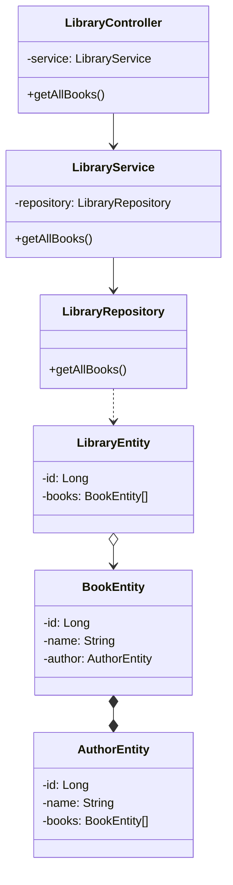

Діаграма класів для LibraryMicroservice
Модифікатори доступу учасників

◆ Приватний (-)

◆ Публічний (+)

◆ Захищений (#)

◆ Пакет (~)

◆ Статичний (підкреслений)

    <ul>
        <li>Асоціація (є посилання, але нема залежності від внутрішньої реалізації) --></li>
        <li>Агрегація (об'єднання незалежних класів) o--</li>
        <li>Композиція (об'єднання залежних класів) *--</li>
        <li>Успадкування (extends) --|></li>
        <li>Реалізація (implements) ..|></li>
        <li>Залежність (внутрішня реалізація об'єкта впливає на класс) ..></li>
    </ul>

