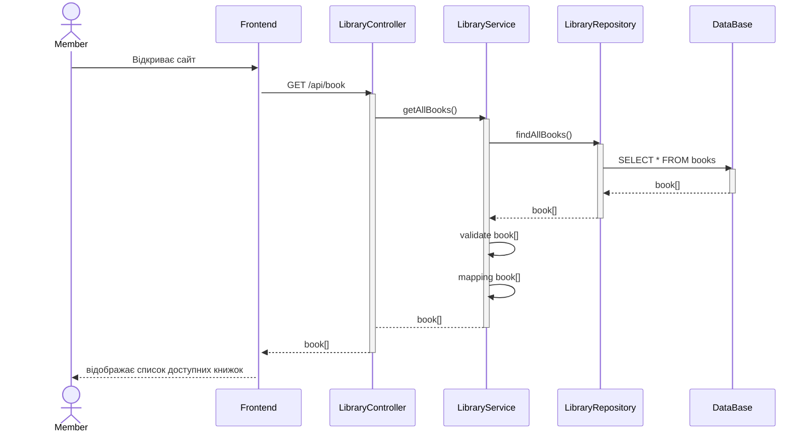

Кейс: користувач заходить на сайт та йому відображається список усіх доступних книжок

```mermaid
sequenceDiagram
    actor Member
    participant Frontend
    participant LibraryController
    participant LibraryService
    participant LibraryRepository
    participant DataBase

    Member ->> Frontend: Відкриває сайт
    activate Frontend
    Frontend ->> LibraryController: GET /api/book
    activate LibraryController
    LibraryController ->> LibraryService: getAllBooks()
    activate LibraryService
    LibraryService ->> LibraryRepository: findAllBooks()
    activate LibraryRepository
    LibraryRepository ->> DataBase: SELECT * FROM books
    activate DataBase
    DataBase -->> LibraryRepository: book[]
    deactivate DataBase
    LibraryRepository -->> LibraryService: book[]
    deactivate LibraryRepository
    LibraryService ->> LibraryService: validate book[]
    LibraryService ->> LibraryService: mapping book[]
    LibraryService -->LibraryController: book[]
    deactivate LibraryService
    LibraryController -->> Frontend: book[]
    deactivate LibraryController
    Frontend -->> Member: відображає список доступних книжок

```